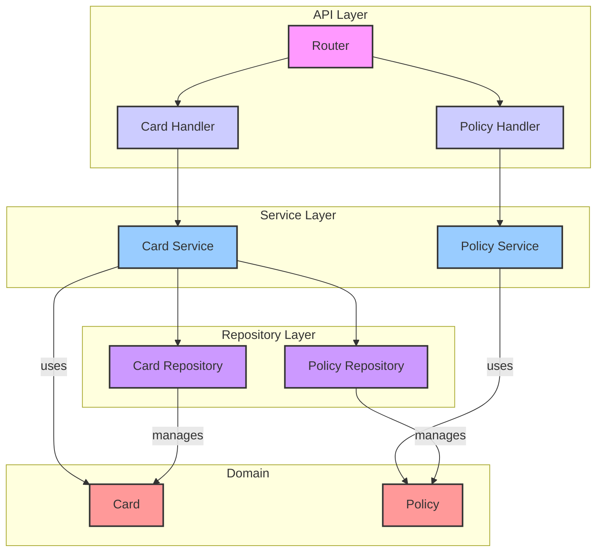
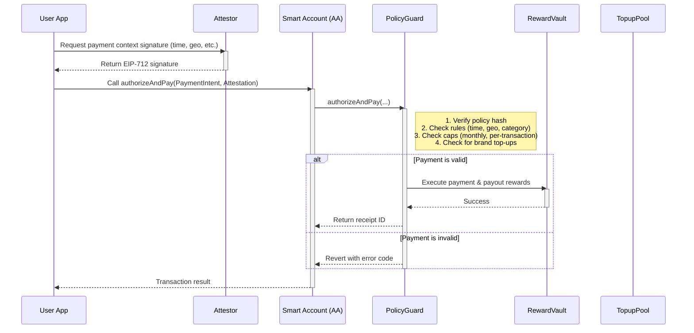

# Flex-Perks: Programmable Rewards Card MVP

Flex-Perks is an MVP project for a programmable credit/check card benefits card that individuals can design themselves.

## Core Idea

The core value is to allow users to describe the benefits they want in natural language, and an LLM compiles the combination of benefits into a policy that is enforced on-chain. When paying, benefits that match the policy (base cashback + brand top-up) are paid immediately. Merchants/brands can make precise targeting by putting a bonus budget for each time, geo, and category, and registration is operated decentrally (based on a deposit).

## Architecture

The project follows a standard Go backend layered architecture.



## Payment Flow Diagram

Here is a diagram illustrating the payment flow based on the project proposal.



## API Endpoints

The MVP backend exposes the following endpoints:

- `POST /api/v1/policies/compile`: Compiles a natural language user request into a policy. In the current MVP, this endpoint simulates the compilation of a policy.
- `POST /api/v1/cards/issue`: Issues a new card for a user with a specific policy.

## Getting Started

### Prerequisites

- Go 1.18 or higher

### Installation & Running

1.  **Clone the repository:**
    ```bash
    git clone https://github.com/rrabit42/mvp-backend.git
    cd mvp-backend
    ```

2.  **Create a configuration file:**
    Create a `config.toml` file in the root of the project with the server port.
    ```toml
    [server]
    port = "8080"
    ```

3.  **Install dependencies:**
    ```bash
    go mod tidy
    ```

4.  **Run the server:**
    ```bash
    go run cmd/server/main.go
    ```
    The server will start on the port specified in your `config.toml`.

## Project Structure

```
mvp-backend/
├── cmd/server/main.go      # Application entry point
├── internal/
│   ├── api/                # API handlers and router setup
│   ├── config/             # Configuration loading
│   ├── domain/             # Core domain models (Card, Policy)
│   ├── repository/         # Data access layer (in-memory for MVP)
│   └── service/            # Business logic layer
├── go.mod
├── go.sum
└── README.md
```

## Future Work (Based on Proposal)

- **LLM Integration**: Implement the LLM policy compiler to translate natural language to a policy DSL.
- **Full Database Integration**: Replace in-memory repositories with a persistent database.
- **Brand/Merchant Features**: Implement the Brand Console and the decentralized merchant registration system.
- **Authentication & Security**: Add robust authentication and security measures.
